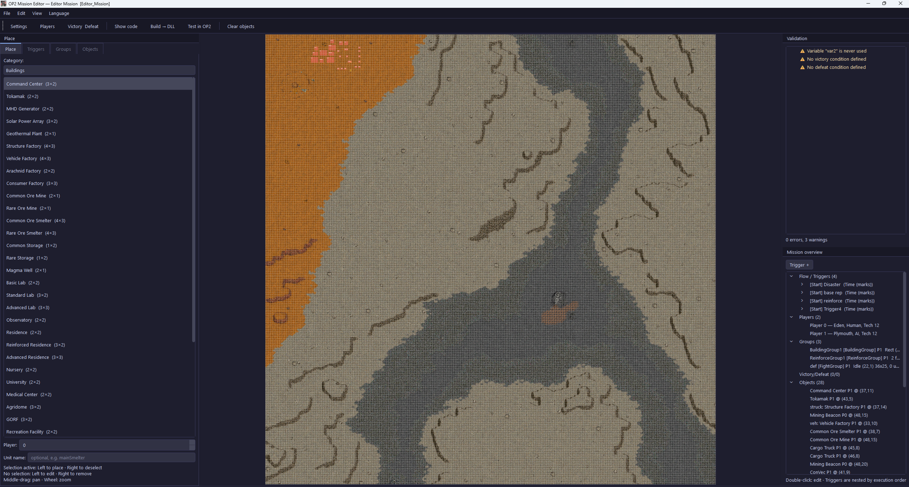
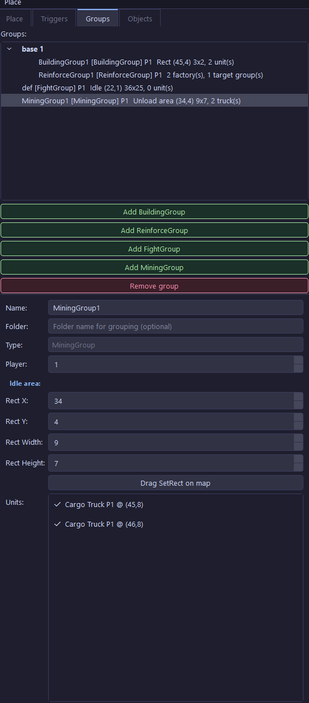
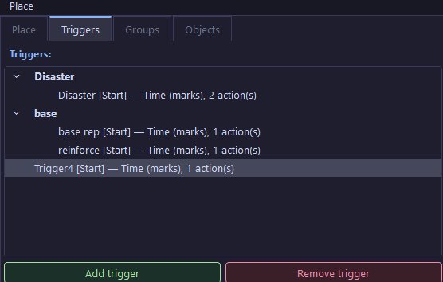

# OP2 Mission Editor — Funktionsdokumentation

Alpha-Version. Die Doku bildet den aktuellen Editor-Stand ab.

## Inhalt

1. [Hauptfenster](#hauptfenster)
2. [Karten-Ansicht](#karten-ansicht)
3. [Panel: Platzieren](#panel-platzieren)
4. [Panel: Gruppen](#panel-gruppen)
5. [Panel: Trigger](#panel-trigger)
6. [Panel: Objekte](#panel-objekte)
7. [Missions-Übersicht & Validierung](#missions-übersicht--validierung)
8. [Dialog: Einstellungen](#dialog-einstellungen)
9. [Dialog: Spieler](#dialog-spieler)
10. [Dialog: Sieg & Niederlage](#dialog-sieg--niederlage)
11. [Aktionseditor](#aktionseditor)
12. [Selbstheilende Gruppen](#selbstheilende-gruppen)
13. [Ausdrucksfelder](#ausdrucksfelder)
14. [Codegenerierung](#codegenerierung)
15. [Projektformat](#projektformat)

---

## Hauptfenster



Drei Bereiche:

- **Linke Seitenleiste** — das gerade aktive Panel: Platzieren / Trigger / Gruppen / Objekte. Umschalten über die Tabs oben.
- **Mitte** — die Kartenansicht.
- **Rechte Seitenleiste** — Validierungsbericht (oben) und Missions-Übersicht (unten).

### Toolbar

| Schaltfläche | Funktion |
|---|---|
| **Einstellungen** | Missionsname, -typ, Techtree, Schwierigkeitswerte, eigene Variablen |
| **Spieler** | Kolonien, Mensch/KI, Tech-Level, Ressourcen, Vorabforschung |
| **Sieg / Niederlage** | Sieg- und Niederlage-Bedingungen |
| **Code anzeigen** | Generierten C++-Code mit Syntax-Highlighting anzeigen |
| **Build → DLL** | Kompilieren und DLL in den OP2-Ordner kopieren |
| **In OP2 testen** | OP2 mit dieser Mission direkt starten (via `op2launcher.exe`) |
| **Objekte leeren** | Alle platzierten Einheiten und Gebäude entfernen |

### Menüs

- **Datei** — Projekt öffnen / speichern / speichern unter · Karte wählen · Ausgabeort · Beenden
- **Bearbeiten** — Rückgängig / Wiederholen der Platzierungs-Schritte
- **Ansicht** — Gitter ein/aus · Zoom 1:1 · Karte einpassen
- **Sprache** — Automatisch (System) · Deutsch · English (greift beim nächsten Start)

---

## Karten-Ansicht

### Maus

| Aktion | Wirkung |
|---|---|
| **Linksklick** | Ausgewähltes Objekt platzieren; ohne Auswahl das Objekt auf dieser Kachel zum Bearbeiten öffnen |
| **Rechtsklick** | Objekt entfernen |
| **Mitteltaste ziehen** | Karte verschieben |
| **Mausrad** | Zoom |
| **Linksklick ziehen** | Rechteck aufziehen (für flächige Aktionen und Gruppen-Bereiche) oder eine gerade Linie (für Tube/Wall-Picker — auf X- oder Y-Achse gelockt, damit Linien gerade bleiben) |

### Visuelle Hinweise

- **Platzierungs-Vorschau** — gestrichelter Fußabdruck am Cursor
- **Aktionslinien-Vorschau** — die Kacheln, die eine recordTube/recordWall-Aktion legen würde
- **Aktionsbereichs-Vorschau** — das Rechteck einer flächigen Aktion, sichtbar solange die Aktion aufgeklappt ist
- **Spielerfarben** — sechs Farben (blau / rot / grün / gelb / lila / cyan)
- **Beacons** in Orange, **Mauern / Rohre** in Grau
- Optionales 1-px-Kachelgitter (Ansicht-Menü)

---

## Panel: Platzieren

Linke Seitenleiste → Tab **Place**.

- **Kategorie** — Gebäude · Fahrzeuge · Beacons & Mauern
- **Einheiten-Liste** mit Fußabdruck-Anzeige
- **Spieler** — 0 – 5
- **Unit-Name** *(optional)* — gibt der Einheit einen im Skript sichtbaren Namen (z. B. `mainSmelter`), sodass Aktionen sie direkt statt per Kachel-Position referenzieren können
- Kontextabhängige Parameter je Einheit:
  - Cargo Truck: Frachttyp + Menge
  - ConVec: Bausatz (welches Gebäude er trägt)
  - Mining Beacon: Erz-Typ (Zufall / Common / Rare) + Ertragsstufe
  - Kampffahrzeuge + Guard Post: Waffe

Linksklick platziert, Rechtsklick entfernt.

---

## Panel: Gruppen

Linke Seitenleiste → Tab **Groups**.



Vier Gruppentypen, je mit eigenem Anlege-Knopf:

### BuildingGroup

Baut Gebäude in einem Rechteck automatisch neu, sobald die Baueinheiten (ConVec, Robo-Miner, …) verfügbar sind.

| Feld | Zweck |
|---|---|
| Name / Ordner | Bezeichner und optionale Gruppierung |
| Spieler | Besitzer |
| Baubereich (X / Y / Breite / Höhe) | Bereich, in dem die Gruppe baut — direkt auf der Karte per **Drag SetRect on map** aufziehbar |
| Einheiten | Ankreuzliste der platzierten Baueinheiten, die zur Gruppe gehören |

### ReinforceGroup

Versorgt andere Gruppen mit Nachschub-Fahrzeugen aus ihren Fabriken.

| Feld | Zweck |
|---|---|
| Reinforce-Ziele | Eine Zielgruppe pro Zeile: `GruppenName=Priorität`. Prioritäten müssen ≥ 1 sein (die Engine hängt bei 0). |
| Einheiten | Ankreuzliste der Fabriken, die zur Gruppe gehören |

### FightGroup

Vordefinierte Kampfgruppe. Angriffswellen (`sendAttackWave`) und Gruppen-Befehle referenzieren sie per Name.

| Feld | Zweck |
|---|---|
| Idle-Bereich | Rückzugs-/Sammelbereich auf der Karte |
| Einheiten | Ankreuzliste militärischer Fahrzeuge, die zur Gruppe gehören |

### MiningGroup

Vordefinierte Erz-Trupp-Gruppe. Eine `startMining`-Aktion verknüpft eine Mine + Smelter und setzt eine Truck-Sollstärke.

| Feld | Zweck |
|---|---|
| Abladebereich | Bereich, in dem die Trucks abladen / warten — die Trucks müssen bei `setupMining()` INNERHALB dieses Rechtecks stehen, typischerweise um den Smelter herum |
| Einheiten | Ankreuzliste der Cargo Trucks, die zur Gruppe gehören |

Gruppen werden als Baum mit optionaler Ordnergruppierung angezeigt. Jedes Panel, das Gruppen referenziert (Aktions-Dropdowns, Trigger-Dropdowns), aktualisiert sich automatisch, sobald du eine Gruppe hinzufügst oder entfernst.

---

## Panel: Trigger

Linke Seitenleiste → Tab **Triggers**.



Zwei Bereiche übereinander:

1. **Trigger-Liste** mit **Add trigger** / **Remove trigger** nebeneinander.
2. Darunter zwei Tabs zum ausgewählten Trigger: **Auslöser** (Ursache + Einstellungen) und **Aktionen** (die Aktionsliste).

### Trigger-Einstellungen (Tab „Auslöser")

| Feld | Zweck |
|---|---|
| Name / Ordner | Bezeichner und optionale Gruppierung |
| Beim Start aktiv | Wird in `initProc` registriert — sonst erst zur Laufzeit per `createTrigger`-Aktion erzeugt |
| Nur einmal auslösen | Wird nach dem ersten Feuern automatisch deaktiviert |
| Auslöser | Was den Trigger feuern lässt (siehe unten) |

### Auslöser-Typen

| Auslöser | Weitere Felder |
|---|---|
| Zeit (Marks) | Marks (Ausdruck, schwierigkeitsabhängig) |
| Punkt erreicht | Spieler, X, Y |
| Rechteck betreten | Spieler, X, Y, Breite, Höhe |
| Gebäude-Anzahl | Spieler, Gebäudetyp, Vergleich, Anzahl |
| Fahrzeug-Anzahl | Spieler, Vergleich, Anzahl |
| Technologie erforscht | Spieler, Tech-ID |
| Ressource erreicht | Spieler, Ressource, Vergleich, Menge |
| Gebäude operativ | Spieler, Gebäudetyp, Vergleich, Anzahl |
| Einheit gefunden | Liste von `(Einheitstyp, X, Y)`-Prüfungen — pollt alle 10 Ticks, feuert wenn *alle* Prüfungen gleichzeitig passen. Nützlich für „warte bis Mine UND Smelter gebaut wurden". |

### Tab „Aktionen"

Die Aktionsliste des ausgewählten Triggers. Aktionen können hinzugefügt, bearbeitet, entfernt und umsortiert werden. Wenn/für-Blöcke lassen sich beliebig tief verschachteln.

---

## Panel: Objekte

Linke Seitenleiste → Tab **Objects**. Flache Liste jeder platzierten Einheit, jedes Gebäudes, jedes Beacons und jeder Wand/Rohres. Praktisch für Massenbearbeitung / Aufräumen.

---

## Missions-Übersicht & Validierung

Rechte Seitenleiste, immer sichtbar:

- **Validierung** *(oben)* — Live-Fehler-/Warnungs-Bericht. Aktualisiert sich bei jeder Änderung. Beispiele: unbenutzte Variable, referenzierte Gruppe existiert nicht, keine Sieg-/Niederlagebedingung gesetzt. Zählung am unteren Rand (`0 errors, 3 warnings`).
- **Missions-Übersicht** *(unten)* — dynamischer Baum mit der ganzen Mission auf einen Blick:
  - **Flow / Trigger** — Ausführungsreihenfolge der Trigger mit Flusspfeilen (⟶) und Zykluserkennung
  - **Spieler** — eine Zeile pro Spieler
  - **Gruppen** — alle BuildingGroups / ReinforceGroups / FightGroups / MiningGroups
  - **Sieg / Niederlage**
  - **Objekte** — Gesamtanzahl platzierter Objekte

Doppelklick auf einen Eintrag öffnet den passenden Editor.

---

## Dialog: Einstellungen

Toolbar → **Einstellungen**.

### Basisdaten

| Feld | Beschreibung |
|---|---|
| Missionsname | Wird in der OP2-Missionsliste angezeigt |
| Missionstyp | Colony · AutoDemo · Tutorial · Multi (Land Rush, Space Race, Resource Race, Midas, Last One Standing) |
| Techtree-Datei | Pfad zur Technologie-Datei (Standard: `MULTITEK.TXT`) |

### Schwierigkeit

Drei Ganzzahlen (Hard / Normal / Easy — Standard 13 / 10 / 5). Stehen als Bezeichner `diff` in allen [Ausdrucksfeldern](#ausdrucksfelder) zur Verfügung.

### Eigene Variablen

Tabelle mit **Name · Typ (int/bool) · Startwert**. Werden als `static` im generierten C++ deklariert, überleben Spielstände, und können:

- per `modVar`-Aktion geändert werden
- per `varCheck`-Bedingung geprüft werden
- in Ausdrucksfeldern referenziert werden

---

## Dialog: Spieler

Toolbar → **Spieler**.

| Feld | Beschreibung |
|---|---|
| Kolonie | Eden oder Plymouth |
| Typ | Mensch oder KI |
| Tech-Level | 0 – 12 (12 = alle Technologien automatisch verfügbar) |
| Startressourcen setzen | Aktiviert das initResources-Flag |
| Kolonisten explizit setzen | Arbeiter / Wissenschaftler / Kinder |
| Ressourcen explizit setzen | Common Ore / Rare Ore / Nahrung (Ausdrucksfelder) |
| Vorab erforscht | Einzelne Technologien per Name hinzufügen |

---

## Dialog: Sieg & Niederlage

Toolbar → **Sieg / Niederlage**.

Dieselben Bedingungstypen wie Trigger-Auslöser (Zeit überstehen, Letzter Überlebender, Raumschiff bauen, kein CC, Gebäude-/Fahrzeug-Anzahl, Tech, Ressource, Gebäude operativ). Jede Bedingung hat ein Beschreibungsfeld — das ist der Zieltext, der im Spiel angezeigt wird.

Beliebig viele Sieg- und Niederlage-Bedingungen kombinierbar.

---

## Aktionseditor

Jede Aktion, die einem Trigger hinzugefügt wird, öffnet das Inline-Aktionsformular.

### Aktionstypen

| Typ | Zweck |
|---|---|
| **Leere Aktion (noop)** | Platzhalter |
| **Wenn / Dann / Sonst** | Bedingungsblock. Kann optional eine **Schleife** tragen (`count` — N-mal wiederholen; `forEach` — über Einheiten iterieren, Quelle: alle / je Spieler / je Typ / im Rechteck / nur Fahrzeuge / nur Gebäude). Dann-/Sonst-Zweige beliebig tief verschachtelbar. Karte hat einen farbigen Rahmen (blau = einfaches If, sky = count, pink = forEach). |
| **Nachricht anzeigen** | Text an den Spieler |
| **Einheit erzeugen** | Liste von Einheit + Waffe + X + Y — die Aktion kann mehrere Einheiten in einem Rutsch spawnen |
| **Katastrophe auslösen** | Meteor / Erdbeben / Sturm / Vortex / Blight / Blight entfernen / Eruption. Position per Ausdruck (z. B. `randBetween(20, 40)`) |
| **Anderen Trigger erstellen** | Erzeugt zur Laufzeit einen anderen definierten Trigger |
| **RecordBuilding** | Liste von `(Gebäudetyp, Fracht, X, Y)`, die einer BuildingGroup aufgenommen werden |
| **RecordTube-Linie** | Liste von `(X, Y) → (X2, Y2)`-Liniensegmenten (im Codegen pro Kachel expandiert) |
| **RecordWall-Linie** | Wie oben, mit Wall-Typ je Eintrag |
| **SetTargCount** | Liste von `(Einheit, Waffe, Anzahl)` — Sollstärke, die eine verknüpfte ReinforceGroup dauerhaft produziert |
| **Gebäude einer Gruppe zuweisen** | Hängt ein Gebäude an Position (X, Y) an eine Gruppe an — pollt bis es auftaucht |
| **Variable ändern** | inc / dec / Ausdruck zuweisen |
| **Mining starten** | Verknüpft Mine + Smelter mit einer MiningGroup und setzt eine Truck-Sollstärke. Siehe unten. |
| **Angriffswelle senden** | Füllt eine vordefinierte FightGroup mit Fahrzeugen und schickt sie los |
| **Gruppen-Befehl** | Angreifen / Bewachen / Patrouille / Einheit hinzufügen/entfernen / Idle-Bereich setzen / … je nach Gruppentyp |
| **Einheiten-Befehl** | move / patrol / repair / transfer / stop / selbstzerstören / … auf eine benannte Einheit oder die aktuelle Schleifen-Einheit |
| **Gebiet verteidigen** | Makro: patrouillieren + angreifen in gegebenem Rechteck |
| **Gebäude reparieren** | Makro: ein ConVec repariert dauerhaft alles Beschädigte im Rechteck |

### Wenn-Bedingungen (Aktions-Gating)

Jede Blatt-Aktion kann durch eine oder mehrere Bedingungen abgesichert werden (UND / ODER):

| Typ | Felder |
|---|---|
| Gebäude an Position vorhanden | Spieler, Gebäudetyp, X, Y |
| Gebäude-Schaden | Spieler, Gebäudetyp, Vergleich, Wert |
| Spieler-Ressource | Spieler, Ressource, Vergleich, Wert |
| Gebäude-Anzahl | Spieler, Gebäudetyp, Vergleich, Wert |
| Technologie erforscht | Spieler, Tech-ID |
| Variable prüfen | Variable, Vergleich, Wert |
| Schleifen-Einheit Typ / Schaden / Fracht / Befehl | (nur innerhalb einer forEach-Schleife) — prüft die aktuelle Schleifen-Einheit |

Jede Bedingung hat ein **Negieren (NICHT)**-Häkchen. Bei verschachtelten Schleifen wählt das Feld `loop_level`, welche Ebene gemeint ist.

### Die `startMining`-Aktion im Detail

Zwei Nutzungsarten, eine Aktion:

1. **Direkter Modus** — Mine und Smelter existieren bereits. Per „Mine (platziert)" / „Smelter (platziert)"-Dropdown auswählen (füllt X/Y automatisch) oder Koordinaten eintippen. Aktion in einen sofort feuernden Trigger packen (`Zeit (Marks) = 0`).
2. **Warten-Modus** — KI/Spieler muss sie erst bauen. Trigger mit Auslöser = **Einheit gefunden** anlegen, zwei Checks hinzufügen: einen für die Mine-Kachel + Mine-Typ, einen für die Smelter-Kachel + Smelter-Typ. Dieselbe `startMining`-Aktion in dessen Aktionsliste packen. Das Aktions-Formular zeigt sogar einen Live-Hinweis mit den passenden Koordinaten:

  > 💡 Um erst zu starten, wenn Mine und Smelter gebaut wurden: Lege einen Trigger mit Auslöser „Einheit gefunden" an und füge zwei Prüfungen hinzu — Einheitentyp der Mine bei Position (X, Y) und Einheitentyp des Smelters bei Position (X2, Y2). Packe diese Mining-Aktion in dessen Aktionsliste.

**Aktion in einer forEach-Schleife?** „Mine" oder „Smelter" von „-- Position (X/Y) --" auf *„Schleifen-Einheit (aktuelle Schleife)"* / *„Schleifen-Einheit (äußere Schleife)"* umstellen — dann nutzt die Aktion, was auch immer die Schleife gerade durchläuft, ohne feste Koordinaten. Benannte Einheiten (Feld „Unit name") sind ebenfalls auswählbar.

Der Zielwert („Transporter") ist ein `Group::setTargCount(CargoTruck, ...)`-Wert, den eine verknüpfte ReinforceGroup dauerhaft nachliefert.

---

## Selbstheilende Gruppen

Die Engine baut zerstörte Strukturen automatisch an derselben Kachel wieder auf. Wenn Fabrik, Mine oder Smelter einer Gruppe zerstört und neu gebaut wird, muss die Gruppe erneut mit dem neuen Gebäude verknüpft werden — sonst bleibt sie funktionsunfähig.

Der Editor erledigt das automatisch: jede generierte Mission bekommt **einen einzigen missionsweiten Timer** `onTick(1 Mark, …, /*oneShot=*/false)`, dessen Callback der Reihe nach durchläuft:

- jedes BuildingGroup-/ReinforceGroup-/MiningGroup-Roster (`takeUnit` erneut ausführen für lebende Einheiten auf den zugewiesenen Kacheln — inklusive Neubauten)
- jede positionsbasierte `startMining`-Aktion (erneut `setupMining` + `setTargCount` ausführen, sobald Mine + Smelter existieren)

Kostet genau **einen** der 64 Callback-Slots der Engine — unabhängig davon, wie viele Gruppen oder Mining-Aktionen die Mission hat. Kein Opt-in, keine Konfiguration — ist für jede Mission an.

---

## Ausdrucksfelder

Überall, wo ein numerisches Eingabefeld schwierigkeitsabhängig sein kann, ersetzt ein **Ausdrucksfeld** die einfache Spinbox. Es akzeptiert entweder:

- eine ganze Zahl (`600`) oder
- einen C++-Ausdruck mit dem Bezeichner `diff` und eigenen Variablen (`ceil(600 * diff / 10)`)

Verfügbare Funktionen: `ceil`, `floor`, `round`, `abs`, `max`, `min`. Verfügbarer Zufall: `getRand(N)`, `randBetween(a, b)`.

### Schwierigkeits-Vorschau

Kommt `diff` im Ausdruck vor, erscheint darunter eine Live-Vorschau der berechneten Werte je Schwierigkeit:

```
Hard: 780  ·  Normal: 600  ·  Easy: 300
```

Werte stammen aus dem Hard/Normal/Easy-Tripel im Einstellungen-Dialog.

### Wo Ausdrucksfelder verwendet werden

- Trigger-Marks (Zeit-Auslöser)
- setTargCount-Zielwert
- Spieler-Ressourcen (Common Ore / Rare Ore / Nahrung)
- ActionCondition-Wert (playerResource, buildingCount, unitDamage, varCheck)
- Katastrophen-Position (X/Y als Ausdruck, z. B. `randBetween(20, 40)`)

---

## Codegenerierung

Der Editor erzeugt eine einzige, in sich geschlossene `mission.cpp` für die TitanAPI-Fassade.

### Dateistruktur

```cpp
// mission.cpp -- generated from the editor model
#include "op2.hpp"
#include "op2/trigger.hpp"
#include "op2/base.hpp"
#include "op2/groups.hpp"
// ...
using namespace op2;

static const int kDiff[] = {5, 10, 13};
static const int diff = kDiff[(int)Player(0).difficulty()];

struct MissionSave {                     // POD, per GetSaveRegions() registriert
    int  cbCount = 0;
    unsigned char cbSlot[64] = {};
    int  meinZaehler = 0;                // eigene Variablen
    bool _mining_armed_0 = false;        // startMining-„armed"-Flags
    Group _grp_0_BG1{};                  // Gruppen-Handles
    Unit  _unit_mainSmelter{};           // benannte Einheiten-Handles
};
static MissionSave g_save;
static int&  meinZaehler   = g_save.meinZaehler;
static Group& _grp_0_BG1   = g_save._grp_0_BG1;
// ...

extern "C" __declspec(dllexport) char LevelDesc[]    = "...";
extern "C" __declspec(dllexport) char MapName[]      = "...";
extern "C" __declspec(dllexport) char TechtreeName[] = "MULTITEK.TXT";

static void initProc() {
    // Spieler-Setup
    // Base Layout
    // Gruppen-Erzeugung + Roster-Übernahme (einmalig)
    // ein gemeinsamer onTick(kTicksPerMark, ...) für die Selbstheilung
    // Startnachricht
    // Sieg-/Niederlage-Bedingungen
    // beim Start aktive Trigger-Helper
}
```

### Koordinaten

Editor-Kacheln sind 0-basiert, TitanAPI-Kacheln 1-basiert. Der Generator addiert automatisch +1 auf jedes X/Y. Jedes ausgegebene `{ x, y }` entspricht der Anzeige in der OP2-Statuszeile.

### Spielstand-Sicherheit

Der komplette persistente Zustand (Variablen, Gruppen-Handles, Unit-Handles, `startMining`-armed-Flags, Callback-Slot-Tabelle) liegt in einem einzigen POD-Struct `MissionSave`, das per `GetSaveRegions()` registriert wird. OP2 ruft `InitProc` beim Laden eines Spielstands **nicht** erneut auf — stattdessen wird der Struct byte-genau restauriert und die Callback-Slot-Tabelle daraus wiederhergestellt.

---

## Projektformat

Ein Projekt ist ein Ordner:

```
MeineMission/
├── project.json     — alle Editor-Felder
├── mission.cpp      — zuletzt generierter C++-Code (bei jedem Build überschrieben)
└── mission.dll      — kompilierte Missions-DLL
```

### `project.json`-Felder

| Schlüssel | Inhalt |
|---|---|
| `mission_name`, `mission_type`, `tech_tree`, `map` | Basisidentität |
| `difficulty` | `{hard, normal, easy}` |
| `variables` | Liste von `{name, var_type, initial_value}` |
| `players` | Vollständige PlayerSpec je Spieler |
| `objects` | Alle platzierten Einheiten / Gebäude |
| `beacons`, `walls_tubes` | Kartenobjekte |
| `building_groups`, `reinforce_groups`, `fight_groups`, `mining_groups` | Die vier Gruppentypen |
| `triggers` | Trigger-Definitionen inkl. verschachtelter Aktionen, Bedingungen und Schleifen |
| `victories`, `defeats` | Sieg- / Niederlage-Bedingungen |
| `node_positions` | Timeline-Knotenpositionen (visueller Zustand) |

Alle Felder sind abwärtskompatibel: unbekannte Schlüssel werden beim Laden ignoriert, fehlende Schlüssel bekommen ihren Dataclass-Standardwert. Alte Missionen ohne vordefinierte FightGroups oder MiningGroups werden beim Öffnen automatisch migriert (siehe `_migrate_wave_fight_groups`, `_migrate_start_mining_groups`).
